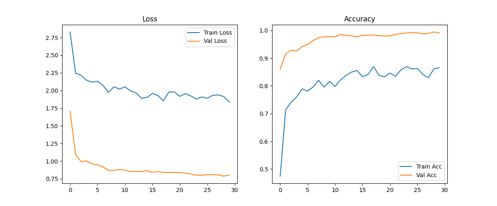
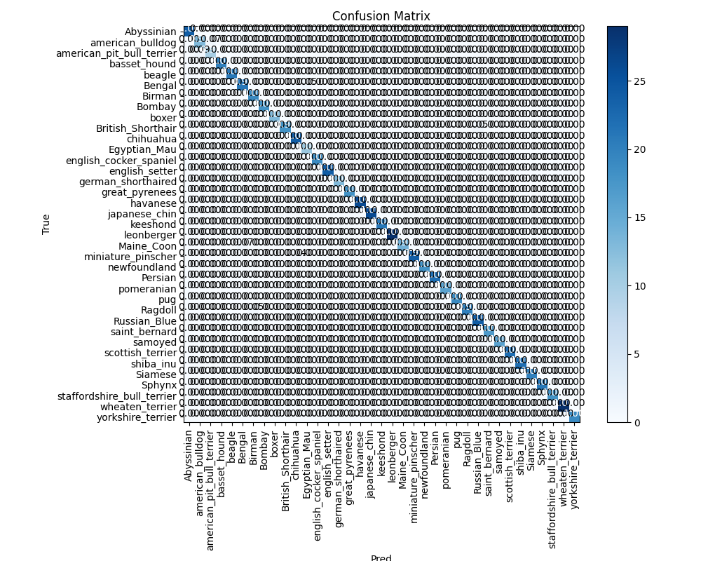

# Clasificación automática de razas de gatos y perros mediante Deep Learning y su implementación en una aplicación móvil

Integrando modelos de redes neuronales profundas como EfficientNet entrenados con datasets públicos como el Oxford-IIIT Pet Dataset.


## Oxford-IIIT Pet Dataset

Dataset disponible en [kaggle](https://www.kaggle.com/datasets/tanlikesmath/the-oxfordiiit-pet-dataset/data)

## Entorno virtual de python (recomendable)

Desde la terminal del proyecto, sigue estos pasos:

* Crear entorno con el siguiente comando

```bash
  python -m venv .venv
```

* Activar el entorno (depende del S.O.)

    *Windows*
    ```bash
    .venv\Scripts\activate
    ```

    *MacOS/Linux*
    ```bash
    source .venv\bin\activate
    ```

* Instalar librerias

    ```bash
    pip install -r requirements.txt
    ```

## 1. Entrenar el modelo

Se realiza ejecutando el script `1-trainning/clasificador_keras.py`

Esto demora dependiendo de las capacidades del equipo y como salida genera un modelo llamado `best_model_efficientnet_b3.keras` en la raiz de la carpeta.

El entrenamiento se ajustó para obtener un accuracy superior al 99% en 30 epocas


Adicionalemnte tambien genera la matrix de confusión


## 2. Convertir el modelo

Se realiza ejecutando el script `2-convert/keras_to_onnx.py`

Toma como archivo de entrada el archivo `best_model_efficientnet_b3.keras` generado en el paso anterior y genera el modelo `best_model_efficientnet_b3.onnx` que se usará en la aplicación android.

## 3. Probar el modelo

Se realiza ejecutando el script `3-test/test_tf_onnx.py`

Utiliza los modelos generados en los pasos 1 y 2 y como archivo de prueba utiliza la imagen `chihuahua.webp` ubicada en la raiz del proyecto. 

Hace la predicción con ambos modelos (EfficientNet-B3 y ONNX) y el resultado es la raza de la mascota de la imagen.
```
TensorFlow: Chihuahua
ONNX: Chihuahua
```

## 4. Aplicación móvil

El proyecto de Android esta desarrollado con Kotlin y Jetpack Compose, para ejecutarlo abrir la carpeta `4-app` con Android Studio.

### Importante
* Copiar el modelo generado `best_model_efficientnet_b3.onnx` en la ruta `app/src/main/assets`.
* El archivo JSON con las razas de las mascotas deben ubicarse en la ruta `app/src/main/assets`.

## Nota
* Inicialmente la aplicacion carga una imagen por defecto y hace la predicción de la misma, el siguiente paso será realizar la carga dinámica y mejorar la interfaz. 